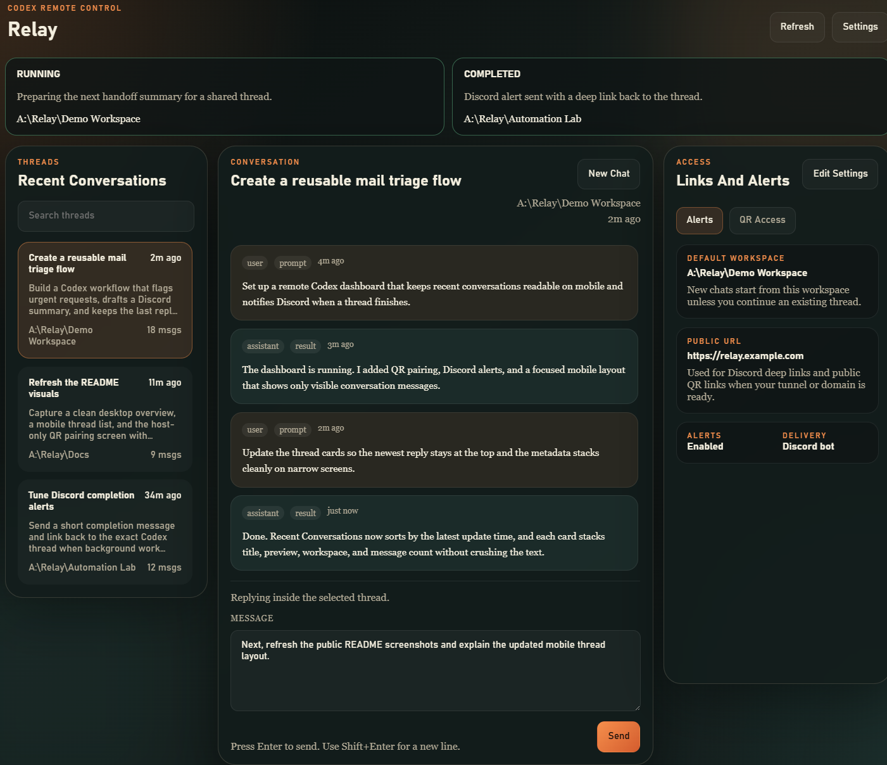
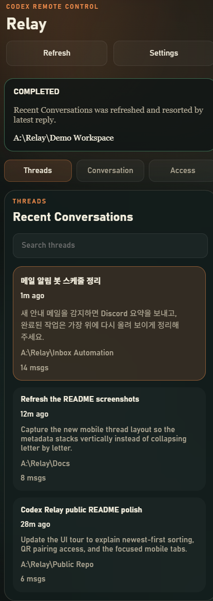
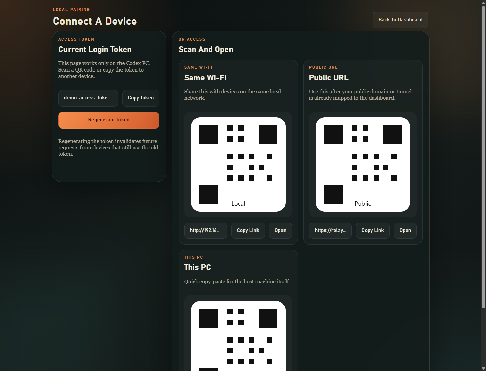
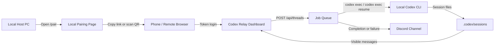

# Codex Relay

한국어: `Codex Relay`는 로컬 PC에서 실행 중인 Codex CLI를 폰이나 다른 브라우저에서 원격으로 확인하고, 같은 화면에서 새 요청을 보내거나 기존 스레드를 이어서 작업할 수 있게 해주는 경량 대시보드입니다.

English: `Codex Relay` is a lightweight dashboard that lets you inspect a local Codex CLI from another device, start new jobs, or continue existing threads from the same browser UI.

## Screenshots

한국어: 아래 이미지는 실제 동작 화면을 바탕으로 만든 데모 캡처이며, 토큰과 링크 같은 민감 정보는 제거되어 있습니다.

English: The screenshots below are sanitized demo captures based on the real UI. Sensitive values such as tokens and links have been removed.

### Dashboard Overview / 대시보드 개요



한국어: 데스크톱에서는 `Threads`, `Conversation`, `Access` 3패널이 동시에 보입니다. 스레드 목록, 현재 대화, 알림/접속 요약을 한 화면에서 함께 볼 수 있습니다.

English: On desktop, the UI shows `Threads`, `Conversation`, and `Access` side by side so you can inspect history, send the next message, and check link/alert status at once.

### Mobile Threads View / 모바일 스레드 화면



한국어: 모바일에서는 `Threads` 탭이 가장 최근에 업데이트된 대화를 맨 위로 올리고, 시간·워크스페이스·메시지 수를 세로로 정리해 좁은 화면에서도 카드가 깨지지 않게 보여 줍니다.

English: On mobile, the `Threads` tab keeps the most recently updated conversation at the top and stacks time, workspace, and message count vertically so cards stay readable on narrow screens.

### Local Pairing Page / 로컬 페어링 페이지



한국어: `http://localhost:3210/pair`는 로컬 PC 전용 페어링 화면입니다. 현재 대시보드 토큰 확인, 토큰 재발급, 토큰 포함 링크 복사, QR 코드 로그인을 한 번에 처리할 수 있습니다.

English: `http://localhost:3210/pair` is the host-only pairing page. It bundles token viewing, token rotation, tokenized links, and QR-based login into one screen.

## UI Tour / UI 둘러보기

| Area | 한국어 설명 | English Description |
| --- | --- | --- |
| `Threads` | 최근에 갱신된 스레드부터 카드형 목록으로 보여 주며, 모바일에서는 제목·요약·워크스페이스·메시지 수를 세로로 정리해 빠르게 훑어볼 수 있습니다. | Shows threads as newest-first cards, and on mobile it stacks title, summary, workspace, and message count vertically for fast scanning. |
| `Conversation` | 선택한 스레드의 보이는 대화만 표시하고, 같은 패널 아래에서 바로 다음 메시지를 보낼 수 있습니다. 메시지마다 이미지 최대 4장까지 첨부할 수 있습니다. | Shows only visible conversation history for the selected thread and keeps the next-message composer in the same panel. You can attach up to four images to each message. |
| `Access` | 기본 워크스페이스, 공개 URL, Discord 알림 상태를 요약하고 `Alerts / QR Access` 탭으로 접속 도구를 나눠 보여줍니다. | Summarizes the default workspace, public URL, and Discord alert state, then splits access tools into `Alerts / QR Access` tabs. |
| `QR Access` | 로컬 브라우저에서는 토큰 복사, 재발급, QR 링크 공유를 바로 처리하고, 원격 브라우저에서는 로컬 PC에서 열라는 안내를 보여줍니다. | On the host browser it exposes token copy, rotation, and QR link sharing; on remote browsers it shows a host-only notice. |
| `Mobile Tabs` | 좁은 화면에서는 `Threads / Conversation / Access` 탭으로 섹션을 전환해 필요한 부분만 크게 봅니다. | On small screens, `Threads / Conversation / Access` tabs switch between focused sections instead of squeezing everything into one column. |

## Why This Exists / 이 프로젝트가 하는 일

한국어:
- 로컬 Codex 작업 내용을 외부 기기에서 확인할 수 있습니다.
- 스레드 히스토리와 이전 대화를 다시 열어 이어서 지시할 수 있습니다.
- `thinking` 같은 자주 변하는 내부 항목은 숨기고, 사용자/어시스턴트 대화와 결과 중심으로 보여줍니다.
- 작업 완료 또는 실패 시 Discord 채널로 바로 알림을 보낼 수 있습니다.

English:
- It exposes local Codex activity to another device.
- It lets you reopen thread history and continue previous conversations.
- It hides volatile internal output such as `thinking` and focuses on visible user/assistant messages and results.
- It can push completion or failure alerts directly into a Discord channel.

## Detailed Features / 상세 기능

- `Visible conversation only`
  한국어: 세션 파일에서 사용자 메시지와 어시스턴트의 최종 응답만 읽어 와서, 흔들리는 중간 상태를 제외한 실제 대화 기록만 보여줍니다.
  English: The dashboard reads session files and keeps only user messages and final assistant responses, excluding noisy transient state.

- `Inline chat composer`
  한국어: 별도 전송 패널 없이 `Conversation` 영역에서 바로 입력합니다. 스레드를 선택하면 이어쓰기, 선택하지 않으면 새 스레드 시작으로 동작합니다.
  English: The `Conversation` panel is the only composer. If a thread is selected, the message resumes it; otherwise it starts a new thread.

- `Image attachments`
  한국어: `Conversation` 패널의 `Add Images` 버튼으로 메시지마다 이미지 최대 4장, 각 파일 최대 10MB까지 첨부할 수 있습니다. 전송 전에는 썸네일과 파일 크기를 미리 확인하고 개별 제거할 수 있습니다.
  English: The `Add Images` control in the `Conversation` panel lets you attach up to four images per message, with a 10 MB limit per file. Before sending, the UI shows a thumbnail, file size, and per-image remove action.

- `Thread history and search`
  한국어: 최근 스레드를 마지막 갱신 시각 기준으로 위에서부터 정렬해 보여 주며, 제목, 첫 사용자 메시지, 마지막 응답 시각, 워크스페이스 경로, 메시지 수를 검색창과 함께 빠르게 훑어볼 수 있습니다. 모바일에서는 카드 메타데이터가 세로로 쌓여 글자가 깨지지 않습니다.
  English: The thread list is ordered by the latest update time, then shows title, first user message, last activity time, workspace path, and message count with instant search filtering. On mobile, card metadata stacks vertically so text does not collapse into broken columns.

- `Queue-based execution`
  한국어: 새 요청은 `codex exec`, 기존 스레드 이어쓰기는 `codex exec resume`으로 실행되며, 내부 큐가 순차 처리해서 로컬 환경을 안정적으로 유지합니다.
  English: New jobs use `codex exec`, while replies to existing threads use `codex exec resume`. An internal queue processes them sequentially.

- `Live refresh`
  한국어: 서버-전송 이벤트로 새 스레드, 상태 변화, 완료 결과를 UI에 반영합니다. 새로고침 없이 스레드 목록과 현재 대화가 갱신됩니다.
  English: Server-sent events stream thread and job updates back into the UI, so thread lists and conversation panes refresh without a full reload.

- `Discord completion alerts`
  한국어: 작업이 끝나거나 실패하면 Discord 웹훅 또는 봇 토큰 + 채널 ID 방식으로 알림을 보낼 수 있고, 알림 안에는 해당 스레드로 바로 여는 링크가 포함됩니다.
  English: On completion or failure, the server can notify Discord through either a webhook or a bot token plus channel ID, including a deep link back to the thread.

- `Local pairing page`
  한국어: `/pair`는 서버가 실행되는 PC에서만 열리며, 현재 토큰 확인, 재발급, LAN/Public/Local용 링크 복사, QR 코드 로그인 준비를 지원합니다.
  English: `/pair` is restricted to the Codex host machine and supports token viewing, token rotation, LAN/Public/Local links, and QR-ready login flow.

- `Tokenized login links`
  한국어: QR 코드나 링크로 접속하면 브라우저가 한 번 로그인한 뒤 `token=` 쿼리를 주소창에서 자동으로 제거하고 `localStorage`에 토큰을 저장합니다.
  English: QR or tokenized links log in once, then automatically remove the `token=` query from the address bar and keep the token in `localStorage`.

- `Startup automation`
  한국어: Windows 시작프로그램 등록 스크립트와 별도 수동 실행 배치 파일이 포함되어 있어, 로그인 시 자동 실행과 수동 백그라운드 실행을 모두 지원합니다.
  English: The repo includes Windows startup registration scripts and a manual launcher batch file for both auto-start and on-demand background launch.

## UI Flow / 화면 흐름



한국어: 원격 브라우저는 대시보드와만 통신하고, 실제 Codex 실행과 세션 읽기는 호스트 PC 내부에서 이뤄집니다.

English: The remote browser only talks to the dashboard. Actual Codex execution and session-file parsing stay on the host machine.

## Quick Start / 빠른 시작

### 1. Install / 설치

```bash
npm install
```

한국어: 의존성은 `qrcode` 하나뿐이지만, 처음 클론한 환경에서는 `npm install`을 한 번 실행해 두는 편이 안전합니다.

English: The project only depends on `qrcode`, but a fresh clone should still run `npm install` once.

### 2. Start the server / 서버 시작

```bash
npm start
```

또는 / or

```bash
node server.mjs
```

한국어: 서버가 시작되면 로컬 URL, LAN URL, 액세스 토큰, 설정 파일 경로를 콘솔에 출력합니다.

English: On startup, the server prints the local URL, LAN URL, access token, and settings file path.

### 3. Open the dashboard / 대시보드 열기

```text
http://localhost:3210
```

한국어: 같은 네트워크의 폰에서는 `http://<your-lan-ip>:3210` 같은 형태로 접속할 수 있습니다.

English: On another device in the same network, use a URL such as `http://<your-lan-ip>:3210`.

### 4. Pair a phone / 폰 연결

```text
http://localhost:3210/pair
```

한국어: 호스트 PC에서만 열리는 페어링 페이지에서 토큰 확인, QR 생성, 링크 복사, 토큰 재발급을 처리합니다.

English: Use the local-only pairing page on the host PC to view the token, generate QR-ready links, copy URLs, or rotate the token.

## Running in the Background / 백그라운드 실행

### Manual launcher / 수동 실행

```bat
start-dashboard.cmd
```

한국어: 이미 서버가 떠 있으면 중복 실행하지 않고, 아니면 백그라운드로 실행합니다.

English: This starts the server in the background and avoids launching duplicates if it is already running.

### Install at Windows sign-in / Windows 시작 시 자동 실행

```bat
install-startup.cmd
```

### Remove startup registration / 자동 실행 해제

```bat
remove-startup.cmd
```

## Settings / 설정

한국어: 런타임 설정은 `data/settings.json`에 저장되며 Git에는 포함되지 않습니다.

English: Runtime settings are stored in `data/settings.json` and are intentionally ignored by Git.

| Key | 한국어 설명 | English Description |
| --- | --- | --- |
| `defaultWorkspaceRoot` | 새 스레드를 시작할 기본 워크스페이스 경로 | Default workspace path used for new threads |
| `workspaceRoots` | UI에서 선택 가능한 워크스페이스 목록 | List of workspace roots available to the UI |
| `publicBaseUrl` | Discord 딥링크와 QR 링크를 만들 때 사용할 공개 주소 | Public base URL used for Discord deep links and QR/login links |
| `notificationEnabled` | 작업 완료/실패 Discord 알림 사용 여부 | Enables Discord completion/failure notifications |
| `discordWebhookUrl` | 웹훅 기반 알림 주소 | Webhook URL for Discord delivery |
| `discordBotToken` | 봇 API 방식 전송용 Bot 토큰 | Bot token used for Discord API delivery |
| `discordChannelId` | 봇이 메시지를 보낼 대상 채널 ID | Target channel ID for bot-based delivery |
| `authToken` | 대시보드 로그인 토큰 | Dashboard login token |

한국어: 봇 기반 전송을 쓰려면 `discordBotToken`과 `discordChannelId`가 둘 다 필요합니다. 웹훅 방식만 쓸 경우 `discordWebhookUrl`만 있어도 됩니다.

English: Bot-based delivery requires both `discordBotToken` and `discordChannelId`. If you only use a webhook, `discordWebhookUrl` is enough.

예시 / Example:

```text
https://relay.example.com
```

한국어: `publicBaseUrl`은 실제 외부에서 접속 가능한 주소여야 하며, 단순히 도메인 문자열만 넣는다고 자동 공개되지는 않습니다.

English: `publicBaseUrl` must be a real externally reachable URL. Setting the value alone does not publish the service.

## Discord Alerts / Discord 알림

한국어:
- 작업 성공과 실패 모두 알림 대상입니다.
- 알림에는 스레드 링크가 포함되어 폰에서 해당 대화로 바로 열 수 있습니다.
- Discord 봇 방식과 웹훅 방식을 모두 지원합니다.

English:
- Both successful and failed jobs can trigger notifications.
- Each alert includes a thread link so you can jump directly into the relevant conversation from your phone.
- Both bot-token delivery and webhook delivery are supported.

## Security Notes / 보안 메모

한국어:
- 이 서버는 로컬 Codex 작업을 실제로 실행하므로 대시보드 토큰은 민감 정보로 취급해야 합니다.
- 기본 실행은 실제 파일 수정이 가능한 완전 자동 모드이며, 더 보수적으로 쓰려면 `CODEX_RELAY_EXECUTION_MODE=sandboxed` 와 `CODEX_RELAY_SANDBOX`, `CODEX_RELAY_APPROVAL` 환경변수로 다시 제한할 수 있습니다.
- `/pair`는 로컬 PC 전용으로 제한되어 있습니다.
- QR 코드와 토큰 포함 링크는 공유 후 즉시 폐기할 수 있도록 토큰 재발급 기능을 제공합니다.
- 인터넷에 직접 열기보다는 LAN, VPN, Tailscale, Cloudflare Tunnel, 인증이 걸린 리버스 프록시를 우선 권장합니다.

English:
- This server can execute real local Codex jobs, so treat the dashboard token as sensitive.
- The default launch mode now uses fully automatic execution so remote jobs can actually edit files. If you need a stricter setup, switch back with `CODEX_RELAY_EXECUTION_MODE=sandboxed` plus `CODEX_RELAY_SANDBOX` and `CODEX_RELAY_APPROVAL`.
- `/pair` is intentionally restricted to the local host machine.
- QR links and tokenized URLs can be invalidated by regenerating the token.
- Prefer LAN, VPN, Tailscale, Cloudflare Tunnel, or an authenticated reverse proxy over exposing the port directly to the public internet.

## External Access / 외부 접속

한국어: `https://relay.example.com`이나 `http://your-hostname:3210` 같은 주소를 실제로 사용하려면 아래 조건이 모두 맞아야 합니다.

English: To make a URL such as `https://relay.example.com` or `http://your-hostname:3210` actually work, all of the following must be true.

- DNS or routing points the hostname to this machine or to a reverse proxy in front of it.
- The firewall allows inbound traffic to the chosen port.
- Port forwarding, reverse proxying, or tunneling is configured correctly.
- `publicBaseUrl` matches the URL remote devices will really open.

## Repository Layout / 저장소 구성

```text
server.mjs               HTTP server, auth, queue, Discord notifications
public/index.html        Main dashboard shell
public/app.js            Dashboard client logic
public/styles.css        Shared UI styling
public/pair.html         Local-only pairing page
public/pair.js           Pairing page client logic
docs/images/             README screenshots
start-dashboard.cmd      Manual background launcher
install-startup.cmd      Windows startup registration
remove-startup.cmd       Removes startup registration
```

## License / 라이선스

한국어: 이 저장소는 `Apache-2.0`으로 배포됩니다. 무료로 사용, 수정, 재배포할 수 있지만, 재배포 시에는 `LICENSE`와 `NOTICE`의 저작자 표기를 유지해야 합니다. 이 저장소의 표기 이름은 `cyy1133`입니다.

English: This repository is distributed under `Apache-2.0`. You can use, modify, and redistribute it for free, but redistributed copies should keep the attribution carried in `LICENSE` and `NOTICE`. The attribution name used in this repository is `cyy1133`.
